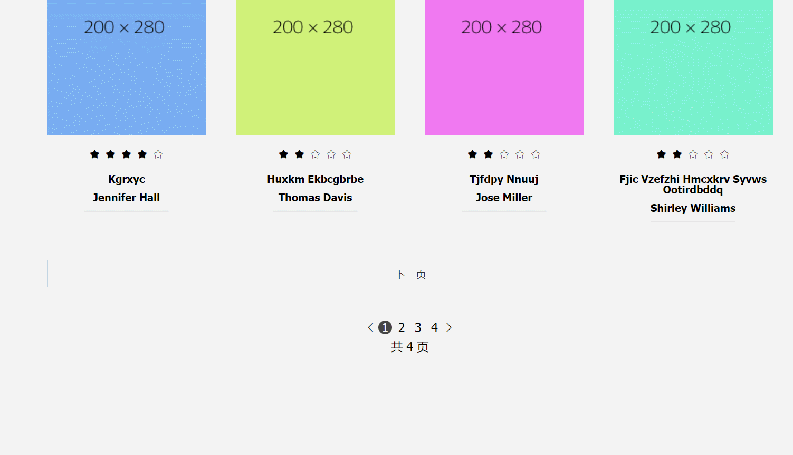

这两天主要是一些收尾工作以及增加一些自己想加的功能，基本的数据交互已经实现的差不多了

## 成果

**首页的登出功能**，实在不知道应该把登出摆哪就直接搁在用户名右边把。。

**点击下一页实现滚动条式加载**，have a look

看似简单，实际上要处理的东西还是不少

比如说我加载一页的方法**不是通过js一个个增加dom节点**去做的，而是先前**先写好八个div**，然后再通过改div内的属性来显示不同内容，但是这样点击下一页的话就不得不增加dom节点

所以在换类别的时候，需要清除一波多余的dom节点。

还有就是到最后一页的时候，这个**下一页的按钮要消失**，而且如果**占位置的class为null的div占满一行的话要适当清除**，不然留白过多，以及显示**详情页的事件要给新加的dom节点绑上**

其实整个过程还挺顺利，索性之前造的轮子还挺好用嗷

## 将要做的

下一步是打算把**搜索页和class页的数据都统一**，固定下来，这样更加真实一点

顺道做个**页面数字过多的时候打点展示**的效果吧