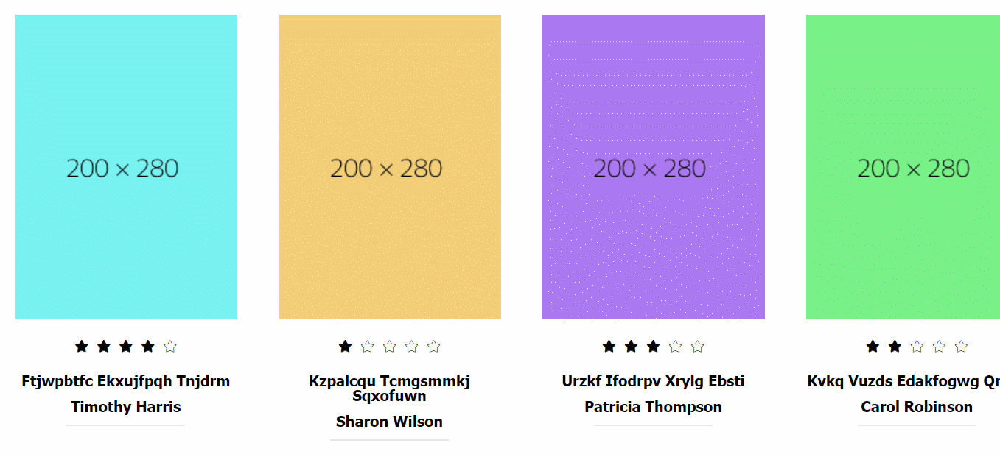
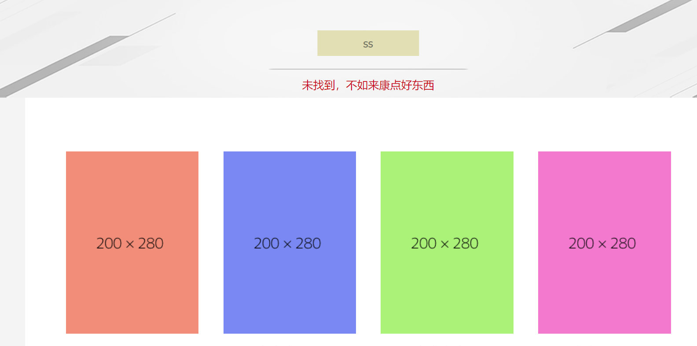

有兴致先提前写了，免得等下又被bug搞到哭

## 成果

成果不明显，都是一些细枝末节的东西

首先是调整了**详情页的弹出位置**。一开始是默认居中于下方展示部分的，结果的话展示部分加长之后居中弹出就显得不那么方便用户了，于是顺道改了改

大概就是从所点击的书的封面上方一点开始展示吧，左右依然是居中

还有就是把搜索页改了一下，**如果没有搜索结果就展示搜索页的所有数据**

## 难题

第一个就是加长页面之后**详情页应该从哪里弹出**的问题，如果给它top值给的太多的话容易溢出页面，思来想去还是觉得在点击盒子的上面一点点开始展示比较好了，然后整个详情页的背景高度稍微给大一些，防止它溢出页面

还有就是搜索页那边，**loading层（height:100%失效）出现时不能覆盖整个文档**

两个方面的原因

- 如果搜索内容为空，下方展示区域如果不显示内容，或者只显示一个高度比较小的提示，就会出现body占不满浏览器高度的问题，这种方法可以给body html标签加height : 100%解决
- 但是如果加了上述style，又会导致页面加长的时候loading层不能覆盖到加长的内容，总之就很迷

决定给搜索不到结果的时候加载些东西

最后还是感激一下之前的我吧，抛开性能不说，之前我造好的轮子还挺好用嗷