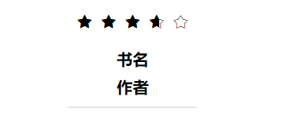

还是准时十二点下班，不愧是我.jpg

今天还是比较摸，然而总归也完成了**搜索页的大体样式**，顺手做了点响应式

flexbox真jb好玩，如果兼容性解决一下就完美了

感觉做的最好的就是星星评价那一部分把，实现了不满星的评价，自我感觉良好，就是代码多了那么一些些

（其实原理就是两种iconfont叠在一起啦

接下来的分类页也差不多是代码复用了，明天把详情也撸一撸也就能大概冲完静态样式了

接下来**交互数据、页面动态响应、轮播**才是真正的考核重点呢，再加把劲吧

