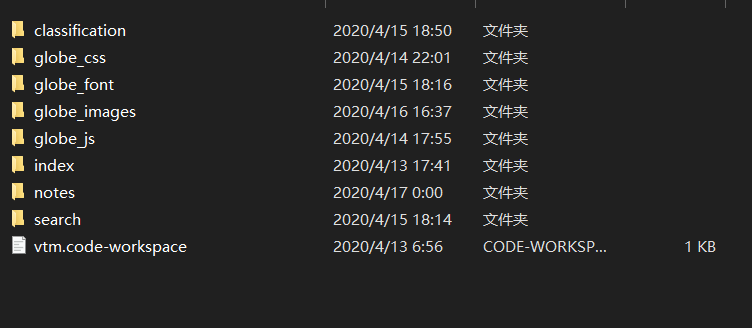
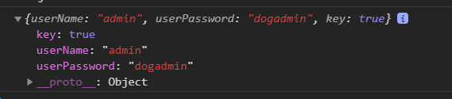

## 成果

今天又是加把劲骑士呢

大概把**静态页面搞得差不多**了，详情页还可以适当加个flex加一些响应式，加不加随缘吧看心情（笑

//嗯 这目录一点都不乱呢

顺便写了一下**登录的数据交互方面**，沦落到拿js去做登录比对判断（不务正业，简单的把所有的用户数据存在了一个数组里，简单粗暴撒，

现在也能简单模拟后台返回东西啦

## 感想

布局方面难的地方还是**详情页小图标布局**吧，找不到对应的iconfont，最后无奈做个精灵图好了，虽然后面加图标方面可能比较麻烦。。

这波写布局和样式的**效率还不是很高**，以后多准备一些css方面的预设、在小问题上不要纠结这么久，可能会比较好一点（总觉得ps上的尺寸跟我网页上呈现的尺寸有所差距