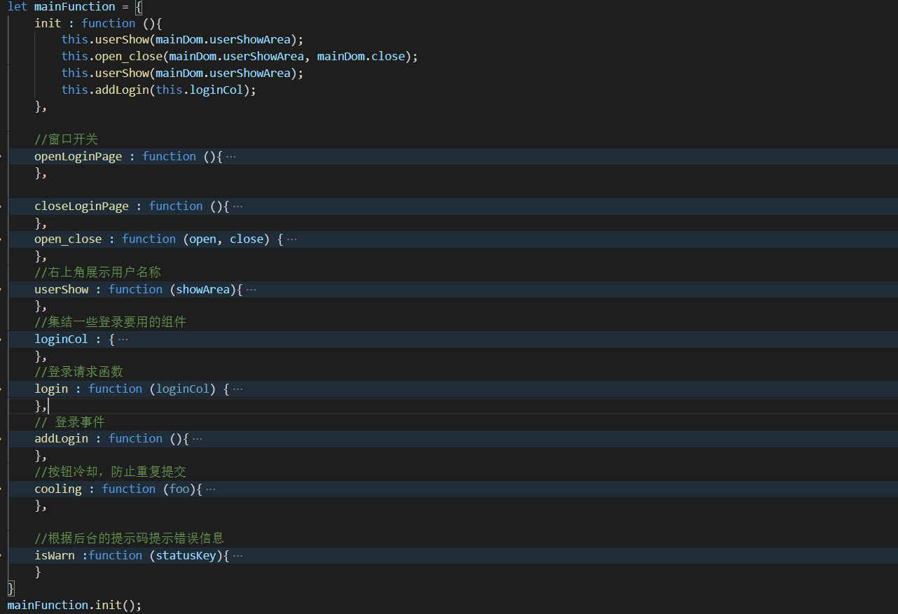
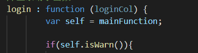

## 成果

简单完成了登录方面的数据交互

实现的功能：

- 输入框有空的时候提示

- 账号不存在、密码错误提示
- 登录成果后右上角id显示，点击id不会再打开登录界面

## 难点

**事件绑定和移除**杀我

一开始死活都没法移除事件，因为结构不对，拿不到相应的回调函数

之后改了一晚上改成了一种有es5特色模块化，虽然我也不清楚到底是不是这样的。。

这种的话内部变量就一直要用this了

然后就出现了绑定事件时this指向改事件的dom元素问题。。（本意是想让他全都指向mainfunction）

为了防止出现 绑定事件中用匿名函数 的现象，所以决定给出问题的函数指定一个假的this

也就是上图的self了

现在想想，es6中的类说不定能解决这个问题。。明天试试吧

还有就是关于要不要用**es6的模块化**这个问题。。

这个我觉得有时间的话再弄吧，毕竟用起来的话要配合打包工具可能才有效果，不然觉得意义不大