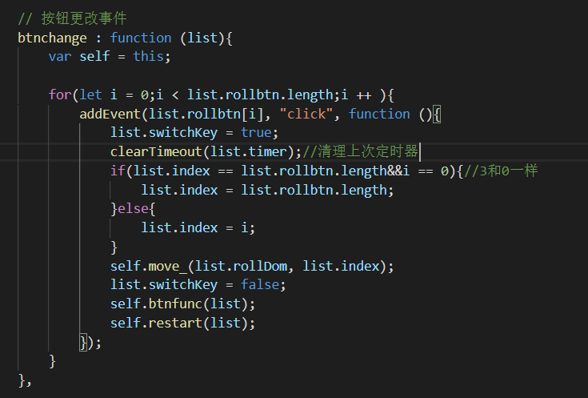
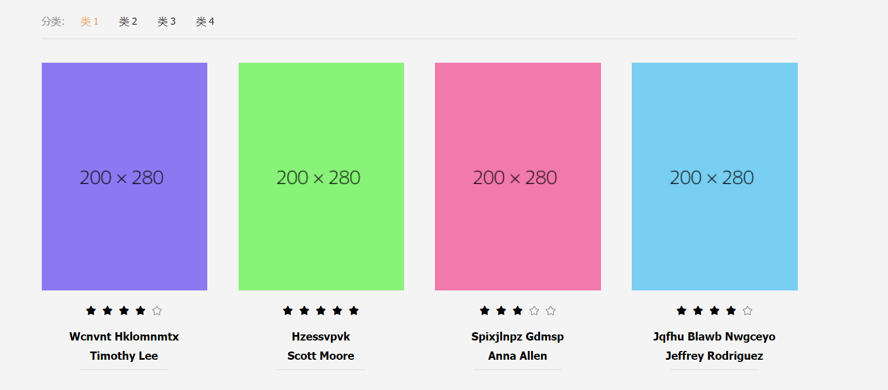

## 收获

- 玩了几个小时的轮播图
- 试着动态写入主要展示界面

## 难点

第三次面对**轮播图**了，还是出现各种细节扣来扣去、、可能是这次的写法跟上两次的有点不同

这次用了settimeout，搞个递归作为循环，可能一定程度上解决了setinterval不准的问题吧

比较烦我的就是跳转的时候怎么把定时器停下来吧，后来还是决定把定时器存到相应的对象里面（其实之前也用的这种方法，一时间换了settimeout以为不能这么干。。

因为用了无缝滚动的骚操作，好像还是存在一点问题

（比如说从1->2的时候偶尔出现滚动方向混乱的问题，其实无伤大雅，有空再解决

还有就是稍微体验了一下从**后台拿数据写入界面**的感觉，还挺爽，简直就是另一种意义上的自动化

当然类别同步、页数同步什么的还没做，明天再奥里给把